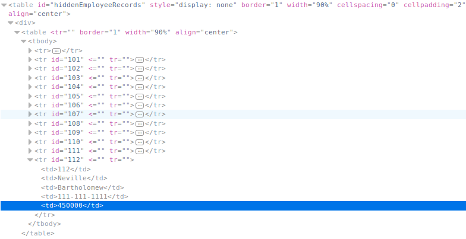
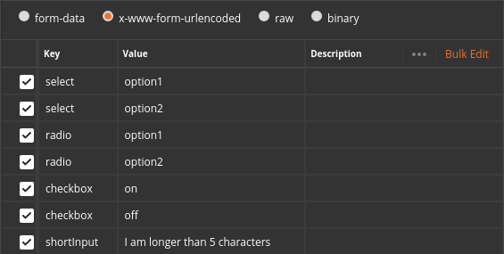
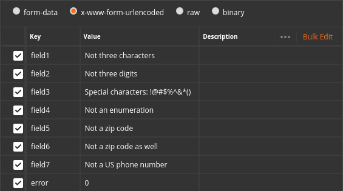
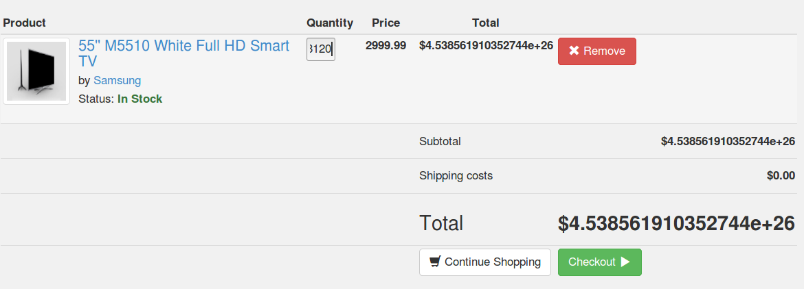

# Client side
## Client side filtering
The answer can be easily extracted by browsing the source of the webpage.

## Bypass front-end restrictions
### Field Restrictions
Field restrictions can be easily bypassed by modifying the HTTP request data.

### Validation
Frontend validation can be easily bypassed by modifying the HTTP request data as well, just like in the previous example.

## HTML tampering
In the Quantity field, insert a number huge enough to cause a float overflow.

