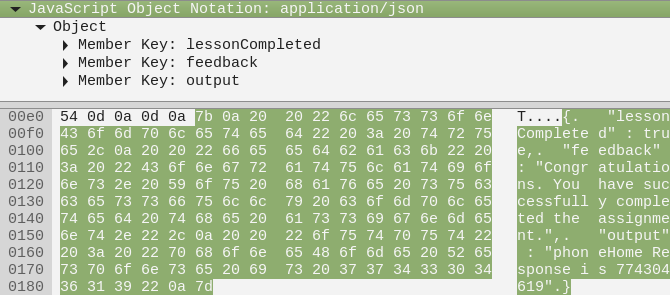

## Cross-Site Scripting (XSS)
### What is XSS
After going through the steps as instructed, you will see that the answer is Yes. Type it in.

### Reflected XSS
1. Open developer tools.
2. Go to > `/WebGoat/start.mvc#test/<script>webgoat.customjs.phoneHome();`
3. This call will POST to > /WebGoat/CrossSiteScripting/phone-home-xss
4. Its response contains the code required for this task.

### Identify Potential for DOM-Based XSS
As suggested, browse through the GoatRouter.js file and find out that the test path is `start.mvc#test/`.

### DOM-Based XSS
1. Open developer tools.
2. Go to > `/WebGoat/start.mvc#test/<script>webgoat.customjs.phoneHome();`
3. This call will POST to > `/WebGoat/CrossSiteScripting/phone-home-xss`
4. Its response contains the code required for this task.
5. Type in the phone number 1353835684 from the response:
```json
{
  "lessonCompleted" : true,
  "feedback" : "Congratulations. You have successfully completed the assignment.",
  "output" : "phoneHome Response is 1353835684"
}
```

### Stored XSS
Post a comment that contains `<script>webgoat.customjs.phoneHome();` and track the traffic in the same manner as in the previous task.

