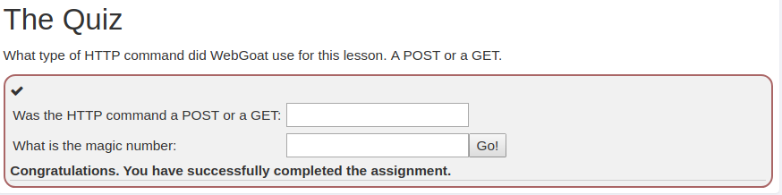

## HTTP Basics
1. Open developer tools (Ctrl+Shif+I).
2. For magic number take a look at form
```http
<form class="attack-form" accept-charset="UNKNOWN" method="POST" name="form"
action="/WebGoat/HttpBasics/attack2" enctype="application/json;charset=UTF-8">
    <script>
        // sample custom javascript in the recommended way ...
        // a namespace has been assigned for it, but you can roll your own if you prefer
        webgoat.customjs.assignRandomVal = function () {
            var x = Math.floor((Math.random() * 100) + 1);
            document.getElementById("magic_num").value = x;
        };
        webgoat.customjs.assignRandomVal();
    </script>
    <input type="hidden" name="magic_num" id="magic_num" value="69">
    <table>
        <tbody><tr>
            <td>Was the HTTP command a POST or a GET:</td>
            <td><input name="answer" value="" type="TEXT"></td>
            <td></td>
        </tr>
        <tr>
            <td>What is the magic number:</td>
            <td>
                <input name="magic_answer" value="" type="TEXT">
                <input name="SUBMIT" value="Go!" type="SUBMIT">
            </td>
            <td></td>
        </tr>
    </tbody></table>
</form>
```
3. there is a hidden input field <input type="hidden" name="magic_num" id="magic_num" value="69"> with value generated by the inline JavaScript code.
4. Check value of value attribute of that input, it is the required answer.
5. For request type open ‘Network’ tab of developer tools.
6. Take a look at attack1 request, in HEADER there is request type POST (magic number value is also visible in attack2 request after failed try under ‘Form Data’).
7. Fill in the form with POST and found magic number.

