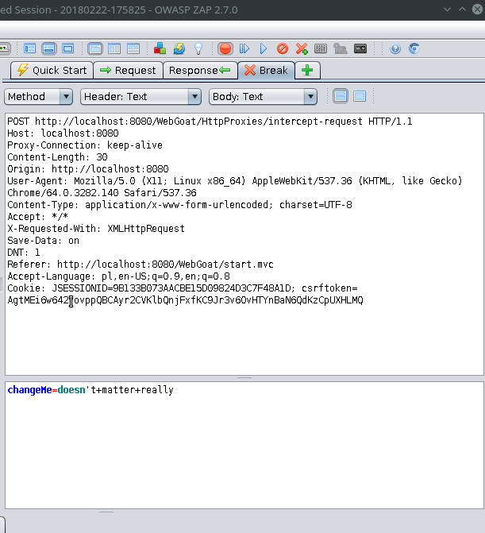
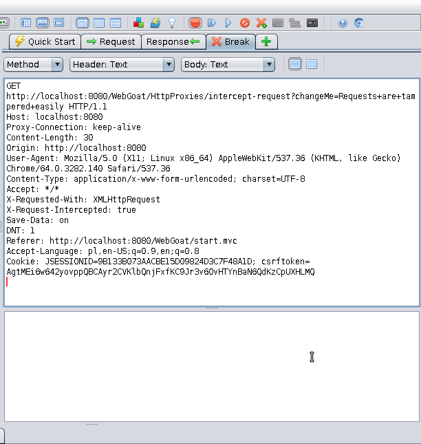
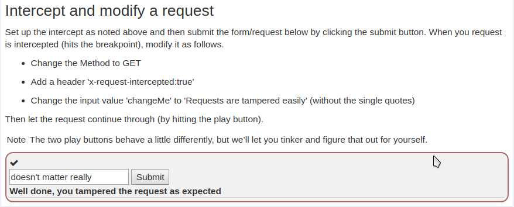

## Http Proxies
1. Follow the instructions of installing and configuring ZAP.
2. Request is intercepted:

3. Modify the request according to instructions:

4. Pass the tempered request through using ‘Play’ button.

