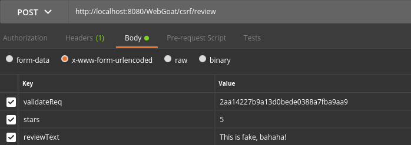

# Request Forgeries
## Basic Get CSRF Exercise
Modify the URI of the request to anything you want and send it to your victim via any digital medium.

`/WebGoat/csrf/basic-get-flag?csrf=true&ubmit%3D=Submit+Query`

## Post a review on someone else’s behalf

### CSRF with stolen cookies and validation key

Intercept a HTTP request. Read the validateReq’s value from request body and the value of cookie named SESSIONID. Set that cookie in your HTTP client, and then send a POST request with Content-Type: application/x-www-form-urlencoded using the validateReq key value in your request (I have sent it using Postman).

## CSRF and Content-Type
Send a POST request to /WebGoat/csrf/feedback/message with Content-Type: text/plain (as in the blog post).

## Login CSRF Attack
If your username is johndoe, then create an account named csrf-johndoe in WebGoat. Then, while logged in as csrf-johndoe, press on the button at the bottom of this page. Log back as johndoe - this assignment will be solved even though we did not do it on this account.
